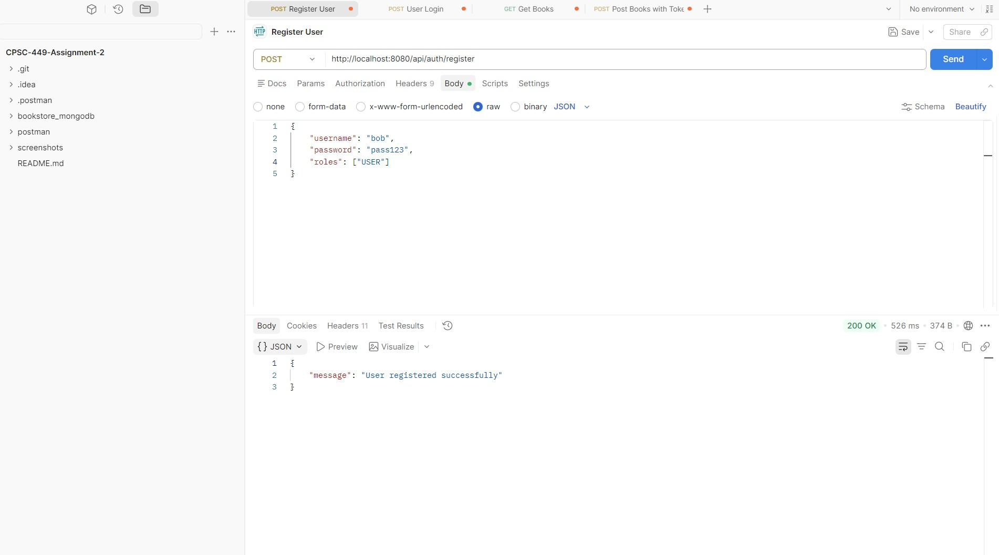
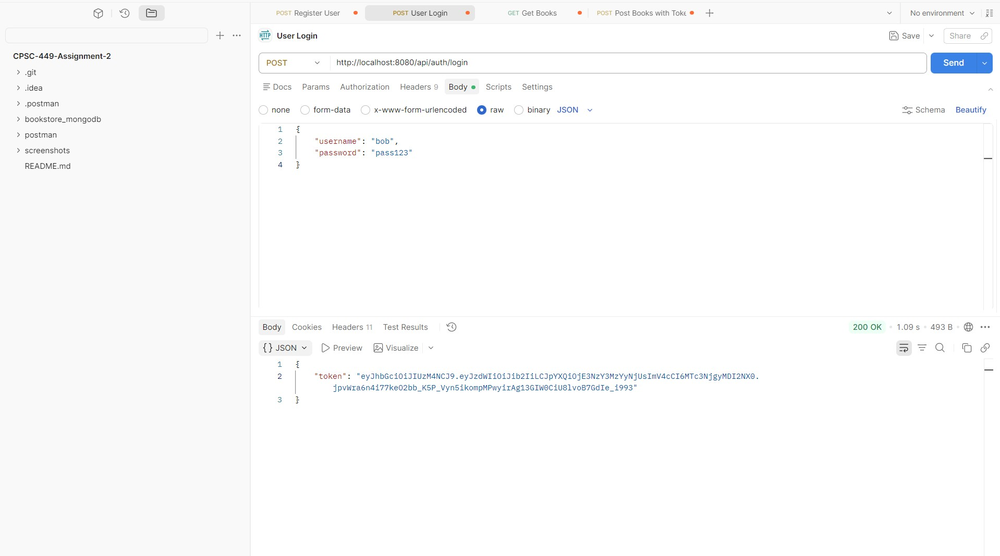
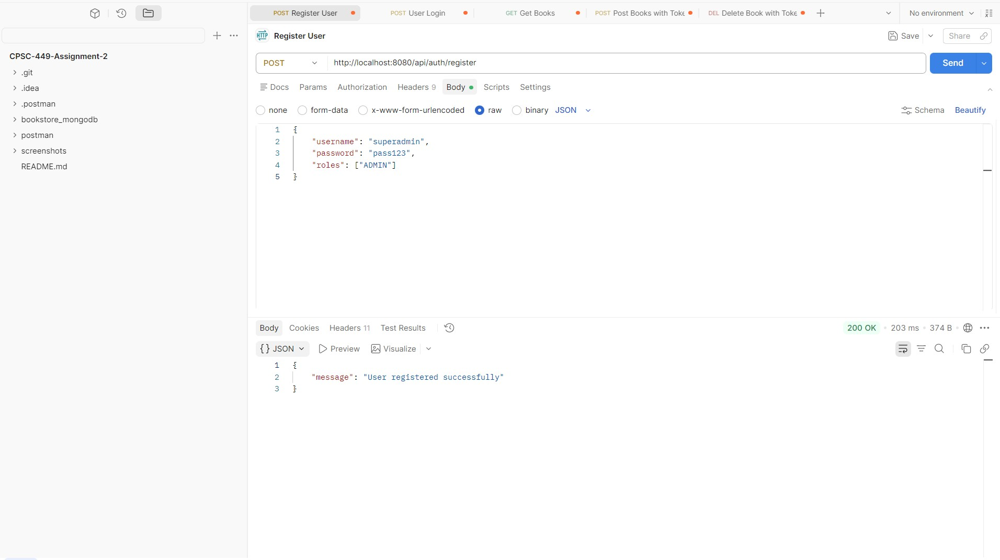
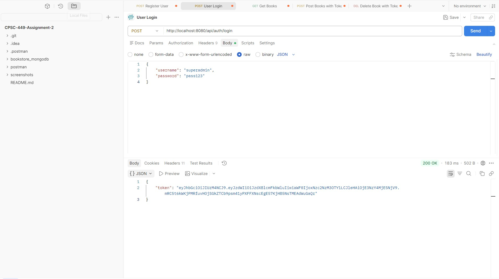
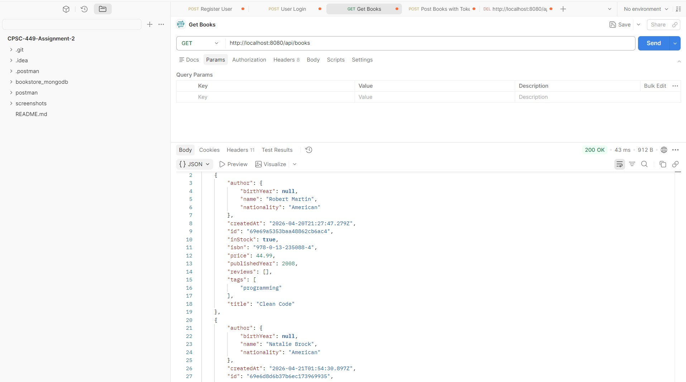
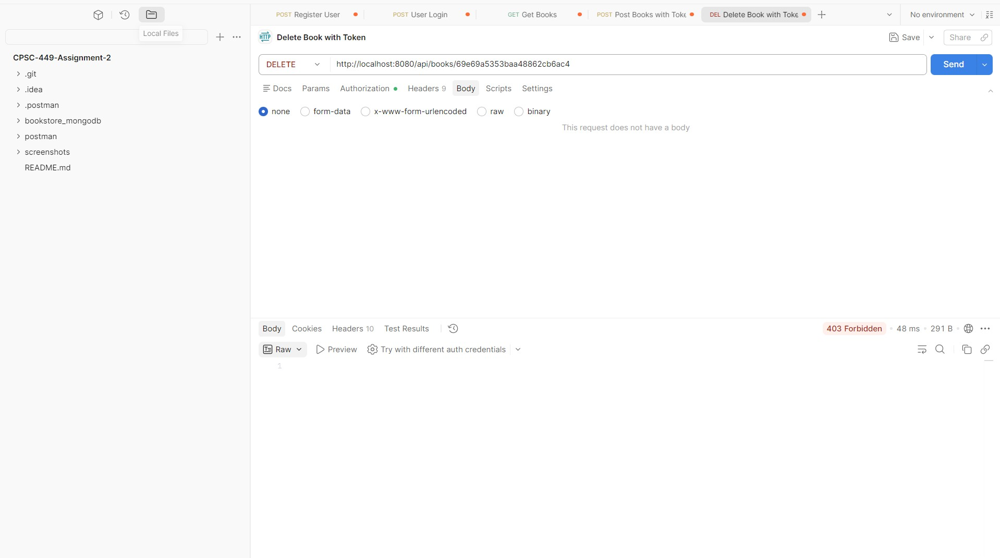
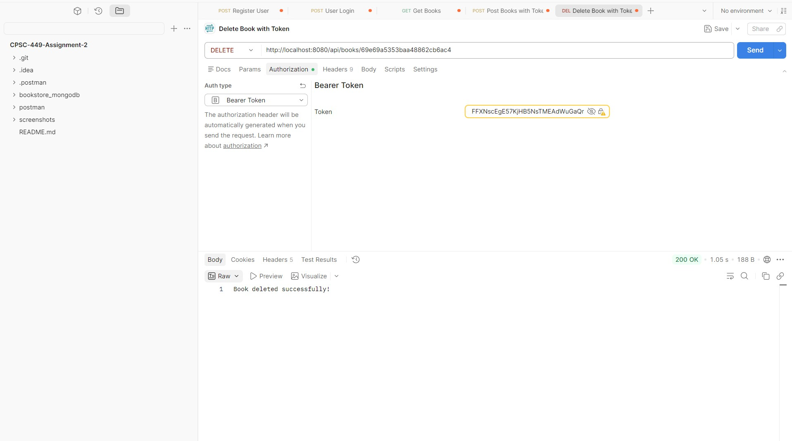
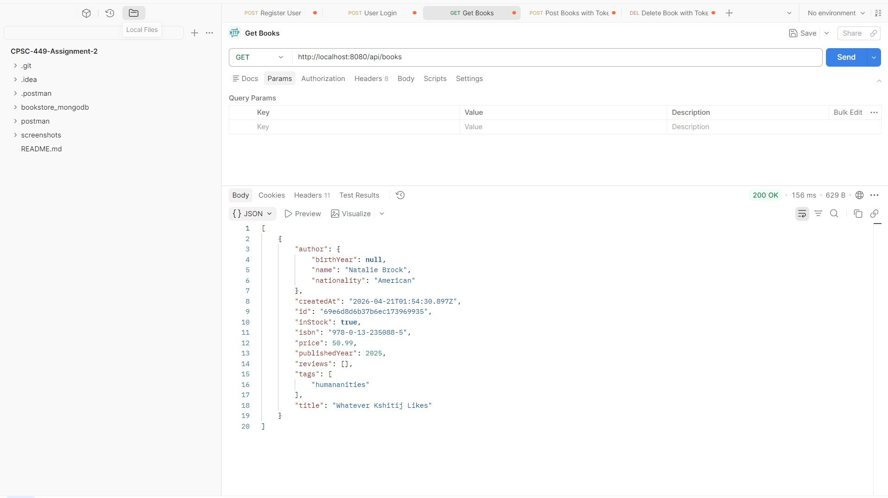

# CPSC 449 : Backend Engineering Assignment 2
By: Kshitij Pingle  

This GitHub repo is for my Assignment 2 where I was tasked with creating an endpoint to delete books authorized only for admins.  

I have also attached screenshots from Postman to show the endpoints are working as expected.  

## Tasks Completed
- Made a DELETE endpoint to delete books  
- Updated SecurityConfig.java to only permit Admins to delete books  
- Tested user registering, login, getting books, and deleting books  

## Postman Screenshots of working endpoints

### 1. User Register and Login

The above is a screenshot of registering a normal user  

The above is a screenshot of a user successfully logging in and receiving their JWT token  

### 2. Admin Register and Login

The above is a screenshot of registering an admin  

The above is a screenshot of an admin successfully logging in and receiving their JWT token  

### 3. GET Before Deleting

The above is a screenshot of getting the books before deleting  

### 4. DELETE Book

The above is a screenshot of trying to delete books with a User's token (unauthorized)  

The above is a screenshot of trying to delete books with an Admin's token (authorized)  

### 5. GET After Deleting

The above is a screenshot of getting the books after deleting, showing that the admin successfully deleted the book  

